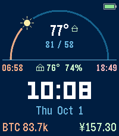

# Sun Arc

A watchface for the Pebble Time 2. The sun travels an arc from sunrise to
sunset, and the moon (in its real phase) takes over at night.



- Current temperature, today's high/low, and a conditions icon on the sun or moon
- Optional [Ambient Weather](https://ambientweather.net) station: your own
  temperature, an extra sensor (greenhouse, indoor, pool...), and a rain gauge
  that appears during a storm
- Sunrise and sunset times
- A crypto price and an exchange rate of your choice
- Battery, plus a buzz and icon when the phone disconnects
- Navy, black and light themes; °F or °C

## Settings

Open the watchface's settings in the Pebble phone app. Ambient Weather keys are
optional: create an API key and an Application key at ambientweather.net under
Account → API Keys. Without keys, weather comes from Open-Meteo for the phone's
location. Keys are stored only on your phone.

## Building

Requires the [Pebble SDK](https://developer.repebble.com/sdk).

```sh
pebble build
pebble install --emulator emery          # run in the emulator
pebble install --phone <phone IP>        # install via the phone's developer connection
```

- `src/c/sun_arc.c` — the watchface (drawing, themes, data from the phone)
- `src/pkjs/index.js` — phone-side code that fetches weather, sun times and prices
- `src/pkjs/config.js` — the settings page ([Clay](https://github.com/pebble/clay))

To design against fixed values, build with `#define MOCK_DATA` at the top of
`sun_arc.c` (see `prv_load_mock`).

## Data sources

Weather: [Open-Meteo](https://open-meteo.com) and Ambient Weather. Crypto:
Coinbase. Exchange rates: [Rates By Exchange Rate API](https://www.exchangerate-api.com).
